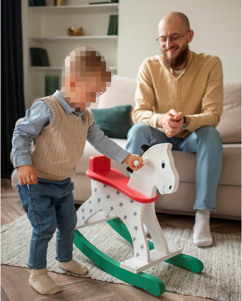
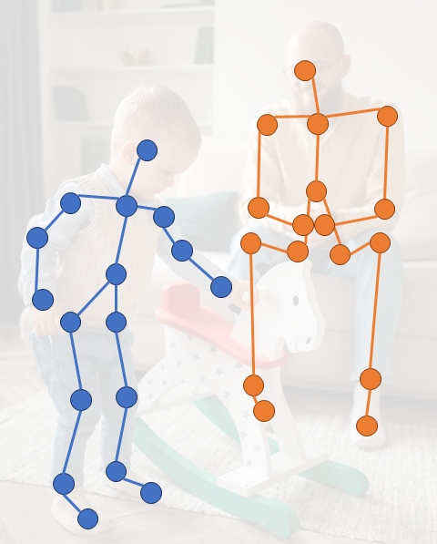
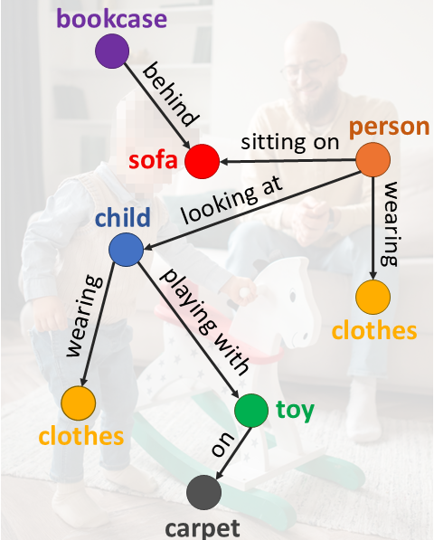

# CSA-Graphs: A Privacy-Preserving Structural Dataset for Child Sexual Abuse Research

This repository provides code for modeling privacy-preserving structural representations (scene graphs and human skeleton poses) for CSAI classification.

---

## Ethical Notice

This repository is intended **strictly for research purposes**.

The methods and representations provided here are designed to support research on **child safety and harm prevention**. Any misuse of these tools for harmful, unethical, or illegal purposes is strictly discouraged.

We do **not provide access to raw or sensitive data**. All representations are designed to preserve privacy and comply with legal and ethical constraints.

Users are solely responsible for ensuring that their use of this code complies with applicable laws and ethical guidelines.

---

## Dataset

Due to **legal and ethical restrictions**, the original dataset (RCPD) is **not publicly available**.

This work relies on **privacy-preserving structural representations**, including:
- Scene graphs
- Human pose (skeleton) graphs

**Example of Graph-Based Representations**

<p align="center">
  
  
  
</p>

<p align="center">
  <em>
  Example of the graph-based representations used in this work. 
  (a) Original image. 
  (b) Skeleton pose graph obtained through human pose estimation. 
  (c) Scene graph describing objects and their relationships in the scene. 
  The graphs are overlaid on the original image for visualization purposes only.
  </em>
</p>

**Planned Release**  
We are currently preparing a public release of the derived dataset (CSA-Graphs) via **Zenodo**.

Access will be granted under a **controlled usage agreement**, requiring users to:
- Agree to ethical use terms
- Comply with legal restrictions
- Use the data strictly for research purposes

Once available, the dataset link will be provided here.

---

## Installation

```bash
conda create -n csagraphs python=3.10
conda activate csagraphs

pip install -r requirements.txt
```

---

## Model Overview

We provide a Graph Neural Network baseline based on **GATv2**:

- **Pose branch**: nodes represent body keypoints with spatial coordinates  
- **Scene graph branch**: nodes represent objects and edges represent relationships  
- **Fusion**: combines both modalities using XGBoost for improved classification performance  

Each experiment is executed with **multiple runs (N)** to ensure robustness, reporting aggregated statistics.


### Usage

#### 1. Skeleton (Pose Graph) Branch

Runs the GAT-based model on pose graphs with **N repeated runs** and reports aggregated results:

```bash
python src/gat_pose.py
```

---

#### 2. Scene Graph Branch

Runs the GAT-based model on scene graphs with **N repeated runs** and aggregated metrics:

```bash
python src/gat_sg.py
```

---

#### 3. Ensemble (Fusion with XGBoost)

Combines both modalities (pose + scene graphs) using an **XGBoost classifier**:

```bash
python src/gat_emsemble_xgboost.py
```

---

## Results

Baseline performance on **CSA-Graphs** using different input modalities.  
SG-baseline operates on scene graphs, Skl-baseline uses skeletons, and Fusion-baseline combines both modalities. Results were obtained using 5-fold cross-validation.

| Method           | Acc. (%)        | Precis. (%)     | Recall (%)      | F1 (%)          |
|------------------|----------------|-----------------|-----------------|-----------------|
| SG-baseline      | 74.47 ± 0.01   | **76.96 ± 0.01**| 72.49 ± 0.03    | 74.31 ± 0.02    |
| Skl-baseline     | 64.39 ± 0.01   | 64.77 ± 0.01    | 67.16 ± 0.02    | 65.66 ± 0.01    |
| Fusion-baseline  | **75.33 ± 0.01**| 76.38 ± 0.01   | **74.96 ± 0.01**| **75.62 ± 0.01**|

---

## Paper

If you use this work, please cite:

```
@inproceedings{caetano:2026:csagraphs,
  title={CSA-Graphs: A Privacy-Preserving Structural Dataset for Child Sexual Abuse Research},
  author={Carlos Caetano, Camila Laranjeira, Clara Ernesto, Artur Barros, João Macedo, Leo Sampaio Ferraz Ribeiro, Jefersson A. dos Santos, Sandra Avila},
  booktitle={Conference on Computer Vision and Pattern Recognition (CVPR) - Workshop on Computer Vision for Children (CV4CHL)},
  year={2026}
}
```

---

## Acknowledgements

This work is part of the **ARACELI project** and was developed in collaboration with Brazilian law enforcement agencies.

---
